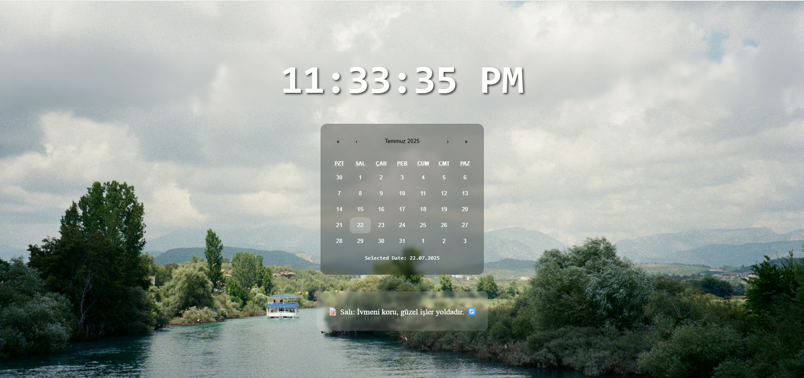

# ⏳ Chronos

Chronos is a minimalist daily dashboard built with **React**.  
It combines a real-time digital clock, an interactive calendar, and daily motivational quotes — all wrapped in a clean, frosted-glass design.

---

## 🖼️ Preview



---

## 🚀 Features

- 🕒 **Live Digital Clock** – updates every second in 12-hour format with AM/PM
- 📅 **Interactive Calendar** – select any date using `react-calendar`
- 📝 **Quote of the Day** – motivational messages based on the day of the week
- 💎 **Modern UI** – glassmorphism style with `backdrop-filter` and soft colors
- 📱 **Responsive Design** – works across screen sizes (optional if true)

---

## 🛠️ Built With

- [React](https://reactjs.org/)
- [React Calendar](https://www.npmjs.com/package/react-calendar)
- HTML & CSS (custom styling)

---

## 📦 Installation

```bash
# Clone the repository
git clone https://github.com/dorukmenguverdi/chronos.git

# Navigate into the project directory
cd chronos

# Install dependencies
npm install

# Start the app
npm start
```

---
📂 Folder Structure

chronos/
├── public/
│   └── screenshot.png
├── src/
│   ├── components/
│   │   ├── DigitalClock.jsx
│   │   ├── CalendarWidget.jsx
│   │   └── QuoteOfTheDay.jsx
│   ├── App.jsx
│   └── index.css
├── README.md
└── .gitignore

---

🌟 Inspiration
The name Chronos is inspired by the Greek god of time.
This project was created to provide a calm, daily-focused dashboard for personal use or to be extended into a productivity tool.
